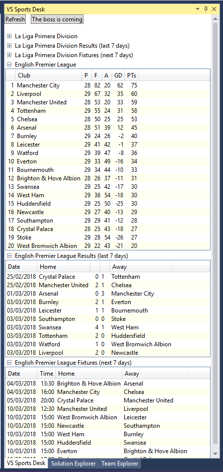
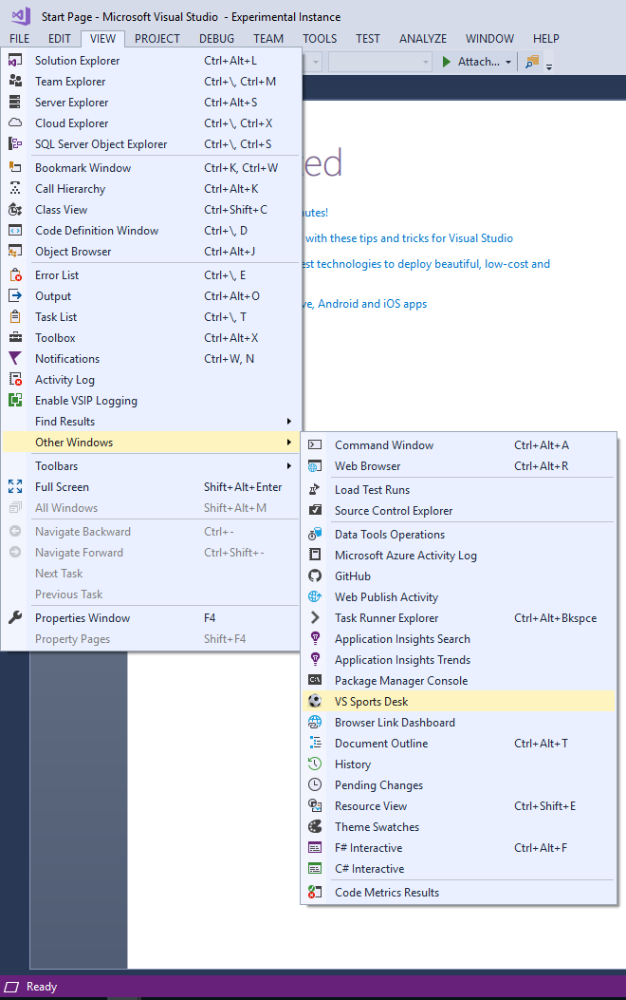
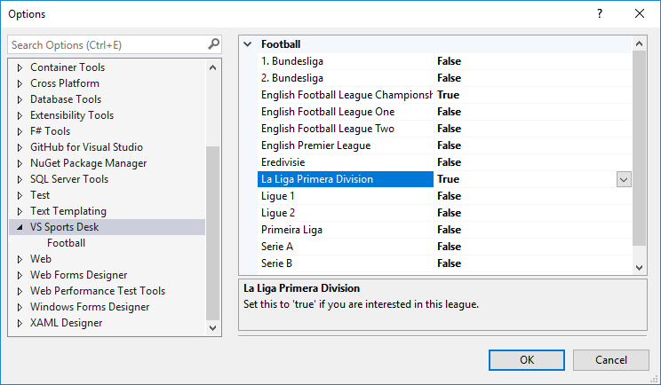
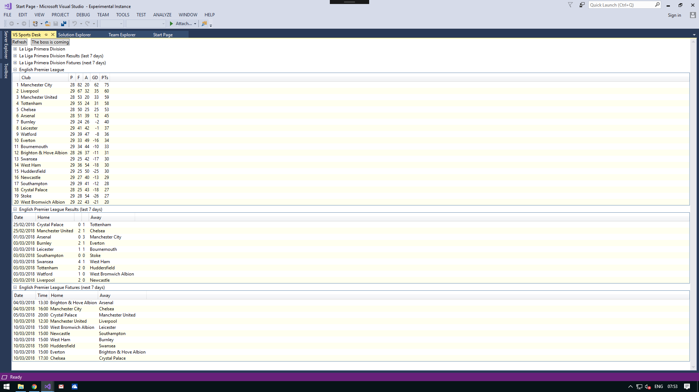
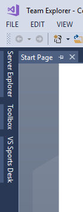
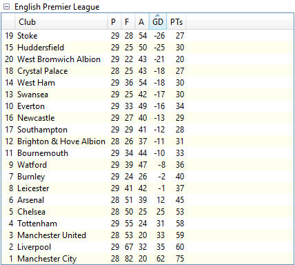
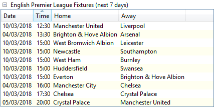

[AppVeyorProjectUrl]: https://ci.appveyor.com/project/GregTrevellick/vsixfootie
[AppVeyorProjectBuildStatusBadgeSvg]: https://ci.appveyor.com/api/projects/status/i7kxey89fewvjkac?svg=true
[GitHubRepoURL]: https://github.com/GregTrevellick/VsixFootie
[GitHubRepoIssuesURL]: https://github.com/GregTrevellick/VsixFootie/issues
[GitHubRepoPullRequestsURL]: https://github.com/GregTrevellick/VsixFootie/pulls
[VersionNumberBadgeURL]: https://vsmarketplacebadge.apphb.com/version/GregTrevellick.VsixFootie.svg
[VisualStudioURL]: https://www.visualstudio.com/
[VSMarketplaceUrl]: https://marketplace.visualstudio.com/search?term=trevellick&target=VS&sortBy=Relevance
[CharityWareURL]: https://github.com/GregTrevellick/MiscellaneousArtefacts/wiki/Charity-Ware
[WhyURL]: https://github.com/GregTrevellick/MiscellaneousArtefacts/wiki/Why

# Visual Studio Sports Desk

[![Build status][AppVeyorProjectBuildStatusBadgeSvg]][AppVeyorProjectUrl]
[![][VersionNumberBadgeURL]][VSMarketplaceUrl]

What more do you want from your IDE than to display the latest soccer scores and tables ? Everything else is just fluff.

So I built a [charity ware][CharityWareURL] [Visual Studio][VisualStudioURL] extension to do exactly that, leveraging the truly awesome labour of love that is [FootballData.org](https://www.football-data.org).

As Daniel Freitag says, I can't guarantee the data to be accurate, up-to-date or correct in any way - though this of course is mine and Daniel's  intention, and it generally will be.

 - *If you LIKE this ***FREE*** extension please give a star rating below, it only takes a few seconds*.

 - *If you LOVE this ***FREE*** extension please [help others][CharityWareURL].*
    
Bugs can be logged [here][GitHubRepoIssuesURL].

See the [change log](CHANGELOG.md) for release history.

Menu access

Options

Full screen if you like

Auto-hide

Sort by any column - reverse goal difference

Sort by any column - match start time

For when the boss is around

[Why?][WhyURL]

## Features

- League standings are displayed in a dockable window, just like the Output window or the Solution Explorer window

- Configure your preferred football leagues from a choice of major European leagues
  - Bundesliga
  - Eredivisie
  - La Liga Primera Division
  - Ligue 1 / Ligue 2
  - Premier League, EFL Championship, EFL League One, EFL League Two (aka Division 1 / 2 / 3 / 4)
  - Primeira Liga
  - Serie A / Serie B

- League tables sortable by any column

- See the last seven days results

- See the next seven days fixtures

- Boss mode (replaces league tables with dummy crash dump data)

## Credits

[Chris Parnin](https://github.com/chrisparnin/wpfPlusMinusExpander)

[Daniel Freitag](https://api.football-data.org/)

[FootballData.org](https://www.football-data.org)

[Marco Lachmann-Anke](http://marco-lachmann.de/)

[Marco Lachmann-Anke 3dman_eu](https://pixabay.com/en/males-3d-model-isolated-3d-model-2358253/)

[Walid Sakhana](https://github.com/sakhana88)

## License

Software License is available [here](/LICENSE.txt).